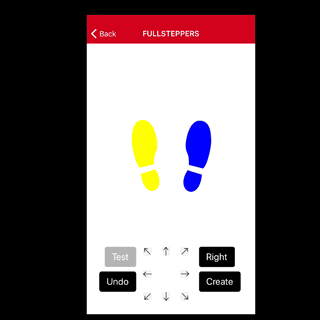

# Fullsteppers

Fullsteppers is your AR dance tutor in mobile app form.

## Installation

First, download the Viro Media App (Viro's testbed app) from the App Store on your iOS device, or from the Play Store for your Android device.

For more information on this testbed app, go [here](https://docs.viromedia.com/docs/develop-with-viro).

Second, fork and clone this repository.

Third, from the root of your forked and cloned repo, install [npm](https://www.npmjs.com/):

```bash
npm install
```

Fourth, from the same place, start the app by running:

```bash
npm start
```

Fifth, and finally, open the Viro Media App on your phone and access our app using the provided NGrok URL or your IP address.

---IMAGES HERE: opening testbed app and running app---


## Usage

Using Fullsteppers is fairly straightforward.

To practice dancing with one of the app's pre-loaded routines, select "Choose Dance" on the home screen.

From there, you will be prompted to choose a song to dance to, a dance speed, and a stance width. Then, get practicing!

To create your own dance for custom practice, select "Create Dance" on the home screen.

Use the arrow menu to direct footsteps. After each arrow push, save that move by hitting "Save." If you regret saving a move, you can undo your last save by hitting "Undo."

Choose which foot to move by toggling the "Right" to "Left" and back again.

---IMAGES HERE: navigating to choose dance and then dancing---

To test your new dance sequence, hit the "Test" button.

Finally, to save, hit "Create." In the next screen, you can select a dance name and a gif that suits its personality.

Now, to practice your customized dance routine for real, just select it from "Choose Dance."

---IMAGES HERE: creating dance---

Want to take your new moves out into the real world? Select "Find Places to Dance" from the end screen to check out recommendations for nearby dance hotspots.

---IMAGES HERE: Yelp recs---

## Contributing

You're welcome to use our app as your own project's launchpad. For pull requests, please open an issue first to discuss what you would like to change.

## License

[Viro](https://docs.viromedia.com/docs/license)
